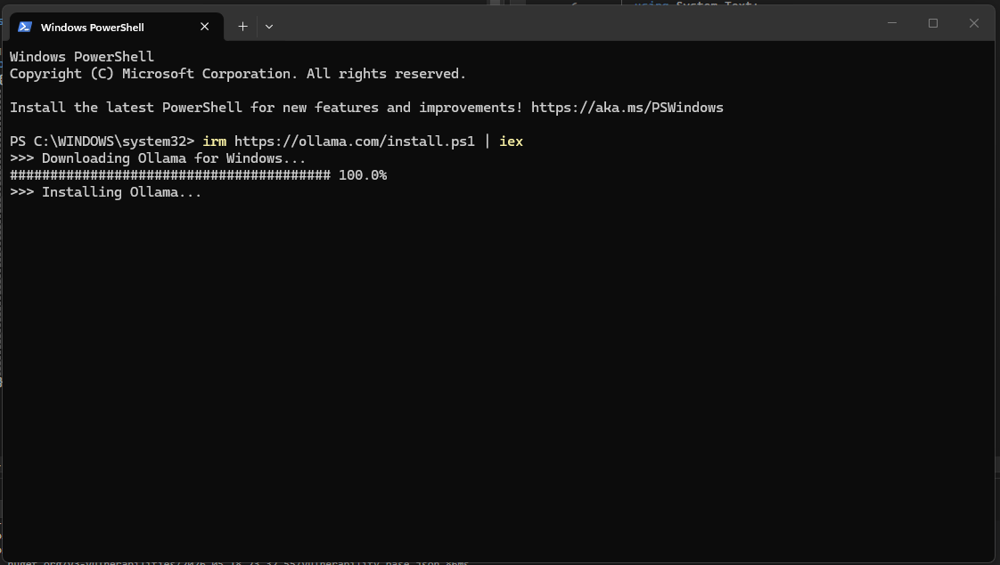

# AI Expense Tracker
AI Expense Tracker is a personal project developed in .NET and Angular with AI-integrated components

AI Integrated for Extracting the expenses from description:
Use a local AI model with Ollama



This runs AI directly on your PC.

No API cost.
No tokens.
No monthly billing.

🚀 How it works

Your app:

Angular → ASP.NET API → Ollama(local AI)

You send:

Today I bought groceries at Lidl for 100 lei cash...

AI returns:

[
  {
    "category": "Groceries",
    "amount": 100,
    "paymentMethod": "Cash",
    "merchant": "Lidl"
  }
]
✅ Installation

Install:
 https://ollama.com/download?utm_source=chatgpt.com


Then run:
```
ollama run llama3
```

or better for extraction:
```
ollama run mistral
```

Why this is best for your project
Pros
100% free
private
works offline
easy API
perfect for portfolio projects
Cons
uses your computer resources
slower than cloud AI
weaker than GPT-4

But for expense extraction?
👉 Totally enough.

✅ ASP.NET Integration

Ollama exposes a local REST API:

http://localhost:11434/api/generate

You call it from ASP.NET.

✅ Example Request
{
  "model": "mistral",
  "prompt": "Extract expenses as JSON from: Today I bought groceries..."
}
✅ Example C# Service
var httpClient = new HttpClient();

var response = await httpClient.PostAsJsonAsync(
    "http://localhost:11434/api/generate",
    new
    {
        model = "mistral",
        prompt = prompt,
        stream = false
    });

var result = await response.Content.ReadAsStringAsync();


✅ Better models for your use case

Inside Ollama:

Good:
ollama run mistral
Better:
ollama run llama3
Very good lightweight extraction:
ollama run phi3
✅ My recommendation for YOU

Since you're building:

ASP.NET backend
Angular frontend
expense extraction feature
likely portfolio/student/personal app

👉 Use:

Ollama
phi3 or mistral

This gives:

local AI
zero cost
realistic AI feature for CV/project
⚠️ Important reality check

Free AI models are:

less accurate
may hallucinate categories
may format JSON badly sometimes

So:

ALWAYS validate output in backend

And preferably:

show editable preview before saving
✅ Alternative free option (cloud)

You could also use:

Google AI Studio
Gemini free tier

BUT:

rate limits
requires internet
may change pricing later

For stable free development:
👉 Ollama is better.

🚀 What I would personally build

For your project:

Angular
   ↓
ASP.NET Core API
   ↓
Ollama (phi3)
   ↓
Structured JSON expenses

That’s modern, impressive, and completely free.

Yes — and you absolutely SHOULD predefine the categories.
That makes the AI much more reliable.

✅ My recommendation

For your expense tracker:

🥇 Best overall:
Ollama + phi3

Run:

ollama run phi3
Why phi3 specifically?

Compared to:

mistral
llama3

phi3 is:

lightweight
fast
surprisingly good at structured extraction
easier on RAM/CPU
perfect for local apps

For your task:

“extract expenses into JSON”

You do NOT need a huge model.

✅ Yes — predefined categories are the correct approach

This is MUCH better:

Food
Transportation
Bills
Entertainment
Shopping
Health
Travel
Education
Other

instead of allowing AI to invent:

“Groceries”
“Supermarket”
“Food Shopping”
“Car Fuel”
etc
✅ Best Prompt Strategy

Tell AI:

Extract expenses from this text.

You MUST use ONLY these categories:
- Food
- Transportation
- Bills
- Entertainment
- Shopping
- Health
- Travel
- Education
- Other

Return valid JSON only.

Text:
"Today I went to Lidl and bought groceries for 100 lei cash..."
✅ Example Output
[
  {
    "category": "Food",
    "amount": 100,
    "currency": "RON",
    "paymentMethod": "Cash",
    "merchant": "Lidl",
    "description": "Groceries from Lidl"
  },
  {
    "category": "Transportation",
    "amount": 50,
    "currency": "RON",
    "paymentMethod": null,
    "merchant": null,
    "description": "Gas for the car"
  }
]
✅ Architecture I recommend
Angular

Textarea:

Describe your expenses...

↓

ASP.NET API

Sends prompt to Ollama

↓

Ollama (phi3)

Returns JSON

↓

Backend validates JSON

↓

Angular preview

↓

User confirms save
✅ Important production advice

Even with predefined categories:

AI may miss fields
AI may output invalid JSON sometimes

So:

NEVER save directly

Always:

parse JSON
validate
let user confirm/edit
✅ C# Model Example
public class ExpenseAiDto
{
    public string Category { get; set; }
    public decimal Amount { get; set; }
    public string Currency { get; set; }
    public string PaymentMethod { get; set; }
    public string Merchant { get; set; }
    public string Description { get; set; }
}
✅ Best UX idea

After extraction:

Show:

Category	Amount	Merchant	Payment
Food	100	Lidl	Cash
Transportation	50	Gas station	-

User edits if needed → Save.

This feels VERY professional.

✅ Final recommendation for YOU

Use:

Ollama
phi3
predefined categories
JSON extraction
ASP.NET validation layer

That’s the best free architecture for your app.